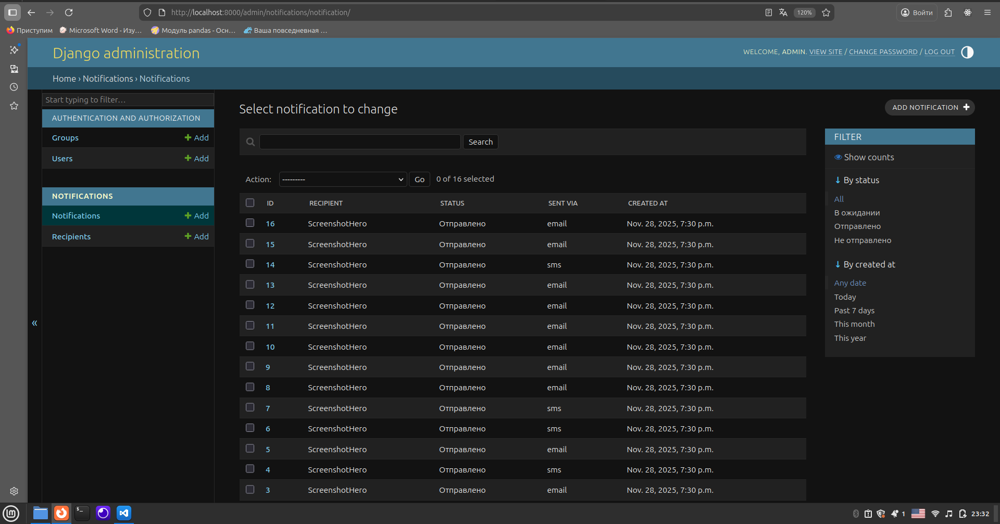
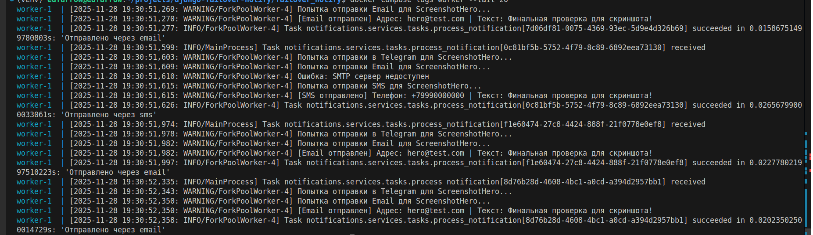
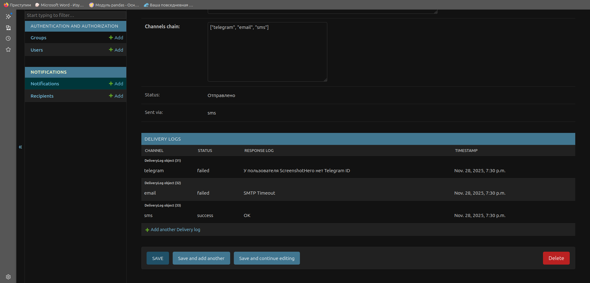

[](https://github.com/EdvardFarrow/django-failover-notify/actions/workflows/ci.yml)

[](README.md)

# Failover Notification Service

Микросервис для рассылки уведомлений с каскадной логикой доставки (Telegram → Email → SMS).
Если основной канал недоступен или возникает ошибка, система автоматически переключается на резервный.

## Особенности
* **Failover System:** Гарантированная доставка сообщения, даже если один из провайдеров упал.
* **Асинхронность:** Обработка через Celery + Redis, API не блокируется.
* **Масштабируемость:** Полная контейнеризация (Docker Compose).
* **Чистая архитектура:** Паттерн Strategy для каналов, валидация данных.

## Архитектурные решения
* **Service Layer:** Логика отправки вынесена из `views.py` в сервисный слой.
* **Strategy Pattern:** Реализация каналов (Email, SMS, TG) через общий интерфейс позволяет легко добавлять новые способы связи (WhatsApp, Push) без изменения основного кода.
* **Atomic Transactions:** Использование `transaction.on_commit` гарантирует, что задача уйдет в Celery только после успешной фиксации записи в БД, предотвращая Race Conditions.
* **Graceful Degradation:** Система продолжает работать, даже если один из внешних сервисов недоступен.

## Технологический стек
* **Python 3.12** + Django 5 + DRF
* **Celery + Redis**
* **PostgreSQL 15**
* **Docker** & Docker Compose

---

## Структура проекта
```text
.
├── failover_notify/           # Конфигурация проекта
│   ├── celery.py              # Настройки Celery и Redis
│   └── settings.py            # Основные настройки Django
│
├── notifications/             # Основное приложение
│   ├── services/              # Бизнес-логика
│   │   ├── channels.py        # Каналы отправки
│   │   └── tasks.py           # Асинхронная задача с ретраями
│   ├── admin.py               # Кастомизация админки
│   ├── models.py              # Модели
│   ├── serializers.py         # Валидация API
│   ├── tests.py               # Тесты
│   └── views.py               # API контроллеры
│
├── docker-compose.yml         # Оркестрация
├── Dockerfile                 # Инструкция сборки
├── Makefile                   # Шорткаты команд
├── setup.py                   # Скрипт авто-развертывания
└── requirements.txt           # Зависимости
```

---

## Быстрый старт

Я подготовил скрипт автоматической установки, который соберет контейнеры, настроит базу и создаст тестовые данные.

### 1. Клонирование
```bash
git clone <https://github.com/EdvardFarrow/django-failover-notify.git>
cd django-failover-notify
```

### 2. Автоматическая установка
```bash
python setup.py
```
*Следуйте инструкциям на экране*

### 3. Ручная установка
```bash
# 1. Создайте .env (см. .env.example)
# 2. Запустите Docker
docker compose up -d --build
# 3. Примените миграции
docker compose exec web python manage.py migrate
```

## Тестирование (API)
После запуска скрипта setup.py в базе уже будет создан тестовый пользователь с ID=1. 
У него специально не указан Telegram ID, чтобы продемонстрировать переключение каналов.

**Отправьте запрос:**
```bash
curl -X POST http://localhost:8000/api/send/ \
     -H "Content-Type: application/json" \
     -d '{
           "recipient": 1,
           "message": "Тестовое сообщение с переключением каналов",
           "channels_chain": ["telegram", "email", "sms"]
         }'
```
**Ожидаемое поведение (смотреть в логах):**

* Попытка отправки в Telegram -> Ошибка (нет ID).

* Попытка отправки на Email -> Успех (или ошибка, если сработала эмуляция сбоя).

* Попытка отправки по SMS -> Успех (если Email не сработал).

Посмотреть логи воркера:
```Bash
docker compose logs -f worker
```

## Мониторинг и Админ-панель
В панели администратора реализован удобный дашборд для отслеживания статусов.
Логи попыток отправки (какой канал, статус, ошибка) отображаются **Inline** — прямо внутри карточки уведомления.

**Доступ:** [http://localhost:8000/admin/](http://localhost:8000/admin/)

*(Логин/пароль создаются на этапе установки)*

## Запуск тестов
Проект покрыт тестами (API endpoints + моки для Celery).
```bash
docker compose exec web python manage.py test
```

---

## Скриншоты работы

### 1. Админ-панель: Список уведомлений
Видно статусы и каналы отправки (смешанные email/sms/telegram).


### 2. Детальный просмотр: Логика Failover
Демонстрация работы алгоритма: попытка в Telegram (ошибка) -> Email (ошибка сети) -> SMS (успех).


### 3. Логи воркера (Terminal)
Техническое подтверждение асинхронной обработки задач.


